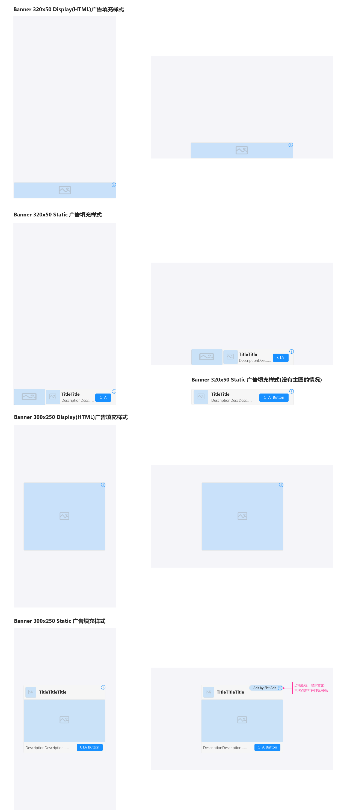

# Banner广告

## 简介

开发者不用自行对广告样式进行编辑和渲染，可直接调用相关接口进行广告展示。

<font color="red">注意：不支持开发者在view添加按钮及对广告拦截处理。</font>

## Banner广告的使用

*  创建广告对象及请求参数

使用Banner广告，需要向布局中添加BannerAdView

```
    <com.flatads.sdk.ui.view.BannerAdView
        android:id="@+id/banner"
        android:layout_width="match_parent"
        android:layout_height="match_parent"
        app:banner_size="small_size"/>
```

app:banner_size：将此属性设置为要使用的广告尺寸。提供了2种类型的banner尺寸：small_size
和 big_size
布局中需给广告广告设置 match_parent。



不设置默认情况是 big_size 。


Java:
```java
BannerAdView bannerAdView = findViewById(R.id.banner);
bannerAdView.setAdUnitId("xxxxxxx");    
```


* BannerView的生命周期

```java
@Override
protected void onResume() {
    super.onResume();
    if (bannerAdView != null) {
        bannerAdView.resume();
    }
}

@Override
protected void onStop() {
    super.onStop();
    if (bannerAdView != null) {
        bannerAdView.stop();
    }
}

@Override
protected void onDestroy() {
    super.onDestroy();
    if (bannerAdView != null) {
        bannerAdView.destroy();
    }
}

```


需要监听广告相关回调事件，在相关的AdView添加Listener。

* 加载监听

```java
bannerAdView.setAdListener(new BannerAdListener() {
    @Override
    public void onAdExposure() {
        // 广告曝光
    }

    @Override
    public void onRenderFail(int code, String msg) {
        // 广告渲染失败
    }

    @Override
    public void onAdClick() {
        // 点击广告
    }

    @Override
    public void onAdClose() {
        // 广告关闭
    }

    @Override
    public void onAdLoadSuc() {
        // 广告请求成功
    }

    @Override
    public void onAdLoadFail(int code, String msg) {
        // 广告请求失败
    }

    @Override
    public void onRefresh() {
        //  自动刷新回调
    }
});
```


* BannerAdListener说明

|回调|说明|
-|-
|onAdExposure|广告曝光
|onRenderFail|广告渲染失败
|onAdClick|点击广告
|onAdClose|广告关闭
|onAdLoadSuc|广告请求成功
|onAdLoadFail|广告请求失败
|onRefresh|自动刷新回调
